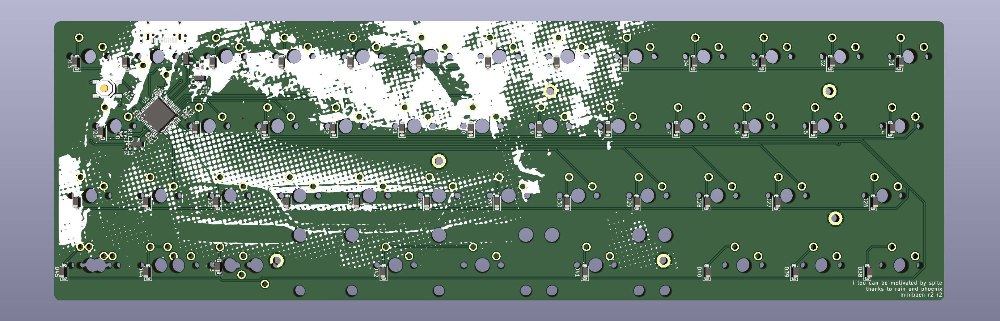

# minilabaen

[kle](http://www.keyboard-layout-editor.com/#/gists/a9f61f5347eb8cae020ee2f3067dfd0b)

made in kicad 7.99 nightly

staggered layout with minibaen spacing (18.68mm x 19.05mm) except on bottom row, which is 12.75u 1.25/1/1.25/2.75/3/1.25/1/1.25 layout

based on minibaen r2, extraneous files from ortho minibaen have not been cleared out so uhhhh watch out.
edge cuts, usb port position, and some tray mount points are lifted from there

stm32f072 schematic is courtesy xphoenixd

this hasn't been tested. bom is missing LCSC info. don't use this.